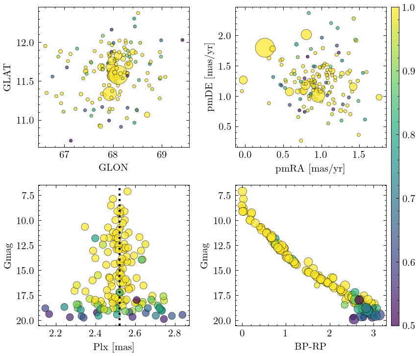

<!-- include Aladin Lite CSS file in the head section of your page -->
<link rel="stylesheet" href="https://aladin.u-strasbg.fr/AladinLite/api/v2/latest/aladin.min.css" />
 <!-- you can skip the following line if your page already integrates the jQuery library -->

 

  

<!-- Left block -->
<!-- Aladin Lite viewer -->

<!-- Aladin Lite viewer -->
<!-- Left block -->

<!-- Right block -->
  <table style="text-align: center;">
  <!-- Row 1 -->
  <tr>
    <th>RA</th>
    <th>DEC</th>
    <th>GLON</th>
    <th>GLAT</th>
    <th>Class</th>
  </tr>
  <!-- Row 2 -->
  <tr>
    <td>276.3456</td>
    <td>66.893</td>
    <td>0.234</td>
    <td>100</td>
    <td>
      <!-- ABCD -->
      A
      B
      C
      D
    </td>
  </tr>
  <!-- Row 3 -->
  <tr>
    <th>Plx</th>
    <th>pmRA</th>
    <th>pmDE</th>
    <th>R_v</th>
    <th>N_20</th>
  </tr>
  <!-- Row 4 -->
  <tr>
    <td>276.3456</td>
    <td>66.893</td>
    <td>0.234</td>
    <td>--</td>
    <td>100</td>
  </tr>
  </table>
<!-- Right block -->

<b>Search region in</b> 

<b>Open data in</b> 

Fundamental parameters in literature (not exhaustive):

<table>
<tr>
<th align="center">

 
 Reference

</th>
<th align="center">

 
 Fundamental parameters

</th>
</tr>
<tr>
<td align="center">
<a href="http://ads.etc">Smith et al. (1970)</a>
</td>
<td align="center">
E_BV=0.13 ; logAge=9.87 ; d_pc=9786 ; [FeH]=0.0
</td>
</tr>
<tr>
<td align="center">
<a href="http://ads.etc">Jones et al. (1970)</a>
</td>
<td align="center">
E_BV=0.3 ; logAge=9.87 ; d_pc=9786 ; [FeH]=-0.1
</td>
</tr>
<tr>
<td align="center">
  <a href="http://ads.etc">Someguy et al. (1970)</a>
</td>
<td align="center">
E_BV=0.13 ; logAge=9.87 ; d_pc=9786 ; [FeH]=0.0
</td>
</tr>
</table>

